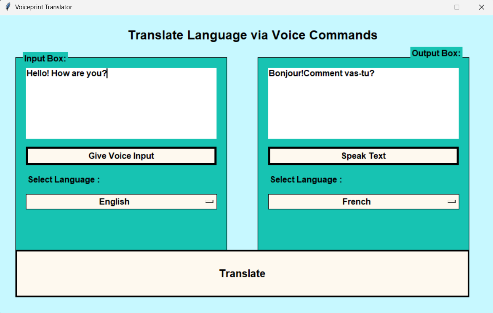

# Language Translator

This repository contains a versatile language translator application, offering both GUI-based and web-based solutions, as well as command-line functionality.

## Overview

This application provides three distinct translation methods:

1.  **Speech Translation (Tkinter GUI):** A user-friendly graphical interface designed specifically for speech-to-speech translation.
2.  **Comprehensive Translation (Flask Web Interface):** A web application capable of translating text, speech, and images.
3.  **Command-Line Translation:** A simple Python script for performing translations directly from the terminal.

All methods utilize the Google Translate API (via `googletrans`) for accurate and efficient translations.

## Files

* **`pytrans.py`**: The main Python script that implements text, speech, and image translation through command line.
* **`tkinter_speech_translation.py`**: A Python script using Tkinter for speech-to-speech translation.
* **`web_translator.py`**: A Flask web application providing a comprehensive translation interface.
* **`templates/`**: Contains HTML templates for the web interface.
* **`static/`**: Contains CSS and other static files for the web interface.

## Requirements

* Python 3.x
* `googletrans` library (`pip install googletrans==4.0.0-rc1`)
    * *Note: The version 4.0.0-rc1 is specified due to issues with the newer versions of googletrans. If you have issues, try this specific version.*
* `Flask` library (`pip install Flask`)
* `Pillow` (PIL) library (`pip install Pillow`)
* `pytesseract` library (`pip install pytesseract`)
* `SpeechRecognition` library (`pip install SpeechRecognition`)
* `PyAudio` library (`pip install pyaudio`) (If using speech features)
* Tesseract-OCR (for image translation)

## Installation

1.  Clone the repository:

    ```bash
    git clone [https://github.com/Deepak250104/Language_Translator.git](https://www.google.com/search?q=https://github.com/Deepak250104/Language_Translator.git)
    cd Language_Translator
    ```

2.  Install the required libraries:

    ```bash
    pip install googletrans==4.0.0-rc1 Flask Pillow pytesseract SpeechRecognition pyaudio
    ```

3.  **Install Tesseract-OCR:**

    * Download and install Tesseract-OCR from [here](https://github.com/UB-Mannheim/tesseract/wiki).
    * Add the Tesseract-OCR installation directory to your system's PATH or environment variables. This enables `pytesseract` to locate the Tesseract executable.

## Usage

### Command-Line Translation (`pytrans.py`)

1.  Run the `pytrans.py` script:

    ```bash
    python pytrans.py
    ```

2.  Follow the prompts to translate text, speech, or images.

### Speech Translation (Tkinter GUI) (`tkinter_speech_translation.py`)

1.  Run the `tkinter_speech_translation.py` script:

    ```bash
    python tkinter_speech_translation.py
    ```

2.  Use the graphical interface to perform speech-to-speech translations.

### Web Translation (Flask) (`web_translator.py`)

1.  Run the `web_translator.py` script:

    ```bash
    python web_translator.py
    ```

2.  Open your web browser and navigate to `http://127.0.0.1:5000/`.

3.  Use the web interface to translate text, speech, or images.

## Example Images

* Web Translation


* Command-Line Translation

 


* Speech Translation (Tkinter GUI)

 




## Language Codes

For a list of language codes supported by `googletrans`, refer to: 
https://developers.google.com/admin-sdk/directory/v1/languages

## Notes

* Ensure Tesseract-OCR is correctly installed and configured for image translation to function.
* The `googletrans` library relies on the Google Translate API, which may have limitations or changes over time.
* The version of googletrans that is used is important, and the readme suggests a working version.

## Author

* Deepak250104

## License

This project is licensed under the MIT License. See the `LICENSE` file for details.
